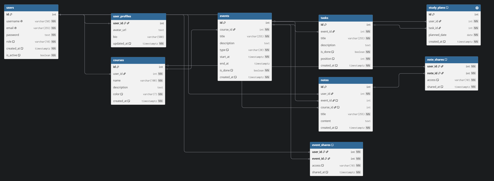
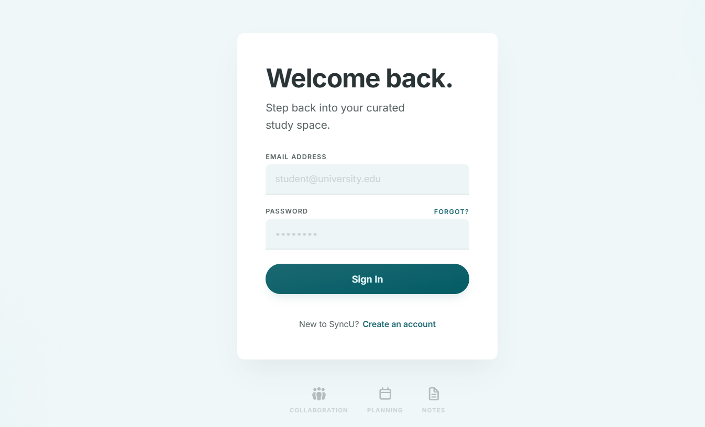
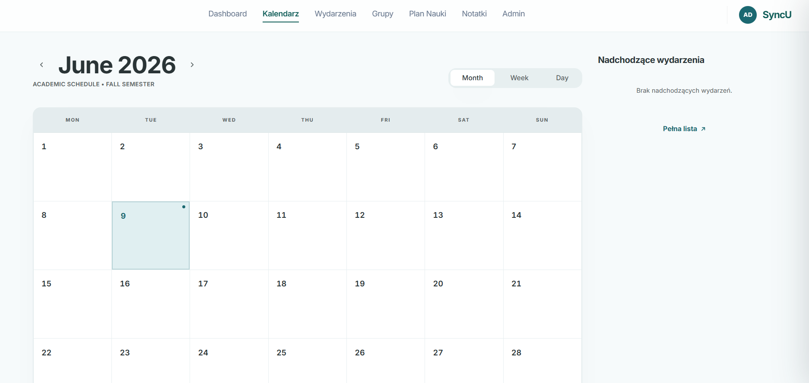
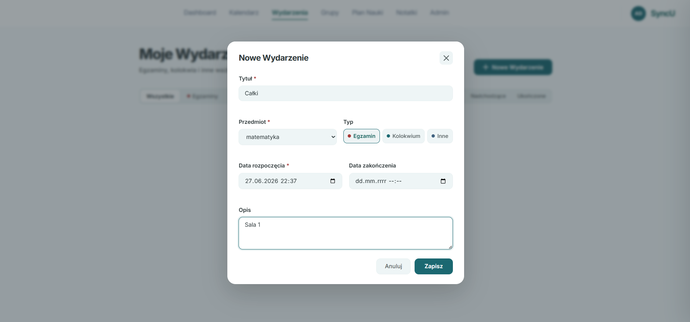
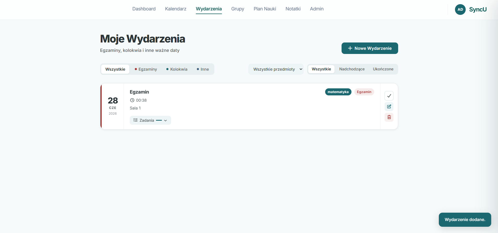
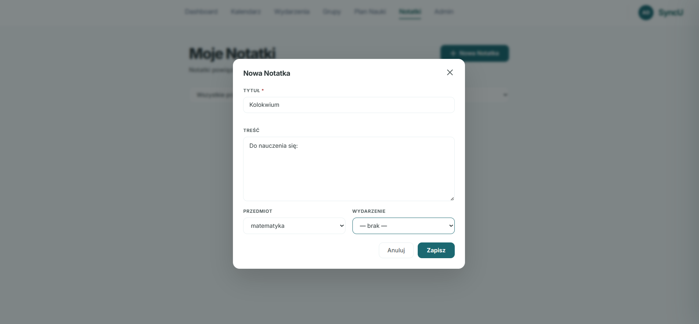
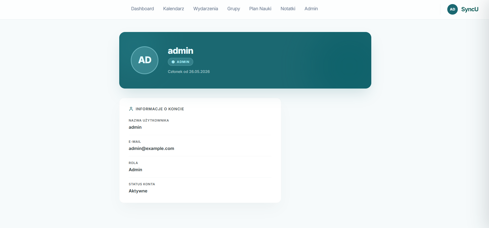
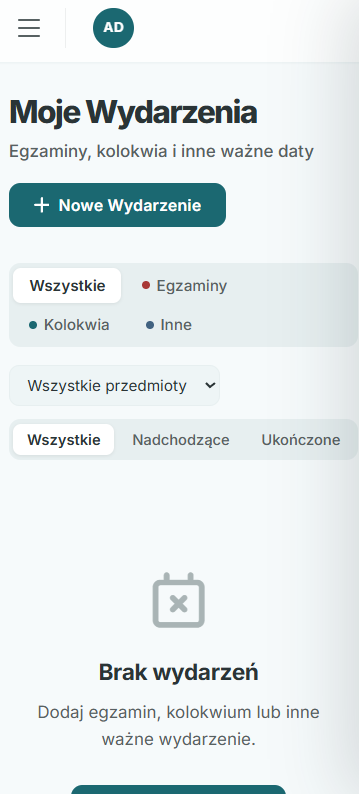
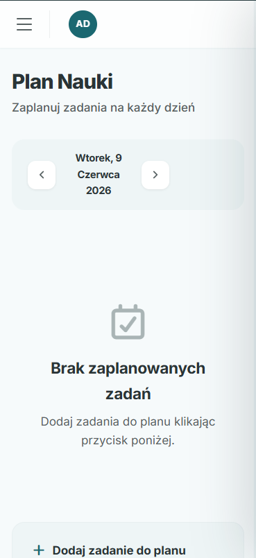

# SyncU — Study Planner

Aplikacja webowa do zarządzania nauką: kursy, wydarzenia, zadania, notatki, plan nauki i współdzielenie zasobów między użytkownikami.

---

## Technologie

| Warstwa | Technologia |
|---------|-------------|
| Backend | PHP 8.2 OOP, bez frameworka, własny MVC + Router |
| Baza danych | PostgreSQL 16 (PDO, widoki, triggery, funkcje, transakcje) |
| Frontend | HTML5, CSS3 (media queries), JavaScript + Fetch API |
| Serwer | Nginx (reverse proxy → PHP-FPM) |
| Konteneryzacja | Docker + Docker Compose |

---

## Wymagania

- [Docker](https://docs.docker.com/get-docker/) ≥ 24
- [Docker Compose](https://docs.docker.com/compose/) ≥ 2 (wbudowany w Docker Desktop)
- Port **8080** wolny (aplikacja), **5433** (PostgreSQL), **5050** (pgAdmin)

---

## Uruchomienie

### 1. Sklonuj repozytorium

```bash
git clone <url-repozytorium>
cd wdpai
```

### 2. Skonfiguruj zmienne środowiskowe

```bash
cp .env.example .env
```

Otwórz `.env` i zmień hasła na własne (szczegóły w sekcji [Konfiguracja .env](#konfiguracja-env)).

### 3. Uruchom kontenery

```bash
docker compose up --build -d
```

Pierwsze uruchomienie pobiera obrazy i buduje kontenery (~2–3 minuty).  
Skrypt `docker/db/init/init.sql` tworzy schemat bazy, a `seed.sql` wgrywa dane testowe.

### 4. Otwórz aplikację

| Adres | Opis |
|-------|------|
| http://localhost:8080 | Aplikacja |
| http://localhost:5050 | pgAdmin (zarządzanie bazą) |

### 5. Zatrzymaj kontenery

```bash
docker compose down          # zatrzymuje kontenery, dane bazy zostają
docker compose down -v       # zatrzymuje i usuwa wolumeny (reset bazy)
```

---

## Konfiguracja .env

Plik `.env` jest odczytywany przez Docker Compose i przekazywany do kontenerów `db` oraz `pgadmin`.

```env
# Połączenie z PostgreSQL (używane wewnątrz sieci Docker)
POSTGRES_HOST=db               # nazwa serwisu w docker-compose — nie zmieniać
POSTGRES_PORT=5432             # port wewnętrzny kontenera — nie zmieniać
POSTGRES_DB=syncu              # nazwa bazy danych
POSTGRES_USER=syncu_user       # użytkownik bazy
POSTGRES_PASSWORD=...          # hasło — ZMIEŃ na własne, silne hasło

# Konto administratora pgAdmin (panel webowy na porcie 5050)
PGADMIN_DEFAULT_EMAIL=admin@example.com
PGADMIN_DEFAULT_PASSWORD=...   # ZMIEŃ na własne hasło
```

> **Uwaga:** plik `.env` zawiera dane uwierzytelniające — nie commituj go do repozytorium.  
> Szablon bez haseł jest w `.env.example`.

---

## Dane testowe (seed)

Po uruchomieniu bazy dostępne są trzy konta:

| Login (email) | Hasło | Rola |
|---------------|-------|------|
| `jan@example.com` | `Student1234!` | user |
| `anna@example.com` | `Student1234!` | user |
| `admin@example.com` | `Admin1234!` | admin |

Użytkownik `jan` ma 2 kursy, 6 wydarzeń, 16 zadań, 4 notatki i 7 wpisów w planie nauki.  
Użytkownik `anna` ma 1 kurs z 2 wydarzeniami. Istnieją przykładowe udostępnienia między nimi.

---

## Testy

### PHPUnit (testy jednostkowe)

```bash
# Zainstaluj zależności (jednorazowo, wymaga PHP + Composer lokalnie lub w kontenerze)
docker exec -it wdpai-php-1 bash -c "cd /app && composer install"

# Uruchom testy
docker exec -it wdpai-php-1 bash -c "cd /app && vendor/bin/phpunit"
```

Testy działają **bez połączenia z bazą** (mocki PHPUnit + ReflectionClass).

| Plik | Liczba testów | Co testuje |
|------|--------------|------------|
| `tests/AuthServiceTest.php` | 6 | Walidacja rejestracji (puste pola, format email, siła hasła, duplikat) |
| `tests/StudyProgressGroupingTest.php` | 2 | Algorytm grupowania planu nauki, obliczanie `plan_pct` |

### Testy endpointów (curl/bash)

Wymagana działająca aplikacja (`docker compose up -d`).

```bash
bash tests/endpoints.sh http://localhost:8080
```

Skrypt testuje kolejno: dostępność stron, ochronę tras (401/302/403), logowanie, CSRF, API po zalogowaniu.

---

## Architektura

```
Przeglądarka
    │  HTTP (Fetch API / form submit)
    ▼
Nginx : 8080
    │  FastCGI
    ▼
PHP-FPM
    │
    ├── index.php → Routing.php
    │       │
    │       ├── AuthGuard   (sesja)
    │       ├── RoleGuard   (rola admin)
    │       └── CsrfGuard   (token CSRF)
    │
    ├── Controllers/      ← obsługa żądań HTTP
    ├── Services/         ← logika biznesowa
    ├── Repository/       ← dostęp do danych (PDO)
    ├── Entity/           ← niemutowalne obiekty domenowe
    └── Views/            ← szablony PHP (HTML)
            │
            ▼
        PostgreSQL : 5432
```

Wzorce: **MVC**, **Repository**, **Service Layer**, **Singleton** (Database), **Value Object** (Entity).

---

## Moduły

| Moduł | Ścieżka | Opis |
|-------|---------|------|
| Autoryzacja | `/login`, `/register`, `/logout` | Rejestracja, logowanie z rate limitingiem |
| Kursy | `/courses`, `/api/courses` | CRUD kursów z kolorami |
| Wydarzenia | `/events`, `/api/events` | CRUD kolokwiów/egzaminów, zmiana statusu |
| Zadania | `/api/tasks` | Checklista, toggle done, reorder (drag), trigger aktualizuje event |
| Notatki | `/notes`, `/api/notes` | CRUD notatek powiązanych z kursem/wydarzeniem |
| Plan nauki | `/study-plan`, `/api/study-plan` | Przypisanie zadań do dni |
| Postęp | `/api/study-progress` | % ukończenia per wydarzenie, plan dzienny |
| Współdzielenie | `/groups`, `/api/shares/*` | Udostępnianie events/notatek z poziomem read/edit |
| Kalendarz | `/calendar`, `/api/events` | Widok miesięczny z Fetch API |
| Panel admina | `/admin` | Zarządzanie użytkownikami (rola, blokada, usunięcie) |

---

## Baza danych

### Tabele (9)
`users` · `user_profiles` · `courses` · `events` · `tasks` · `notes` · `study_plans` · `event_shares` · `note_shares`

### Elementy zaawansowane

| Element | Nazwa | Opis |
|---------|-------|------|
| Widok | `v_events_with_course` | JOIN events + courses + users |
| Widok | `v_event_progress` | Postęp wydarzeń z użyciem funkcji |
| Funkcja | `get_completion_pct(event_id)` | % ukończonych zadań dla wydarzenia |
| Trigger | `trg_update_event_status` | Auto-zmiana `events.is_done` po zmianie tasków |
| Trigger | `trg_create_user_profile` | Auto-tworzenie profilu po rejestracji (relacja 1:1) |
| Trigger | `trg_prevent_self_share` | Blokada udostępnienia samemu sobie (RAISE P0001) |
| Transakcja | `EventRepository::createWithTasks` | REPEATABLE READ — atomowe tworzenie event + taski |

### Relacje
- **1:1** `users` → `user_profiles`
- **1:N** `users→courses→events→tasks`, `users→notes`
- **M:N** `users ↔ events` (przez `event_shares`), `users ↔ notes` (przez `note_shares`)

Schemat w `docker/db/init/init.sql`, dane testowe w `docker/db/init/seed.sql`.

### Diagram ERD



[Źródło — dbdiagram.io](https://dbdiagram.io/d/6a287e2a8eb8ca4bfe8e3003)


---

## Bezpieczeństwo

| Mechanizm | Szczegóły |
|-----------|-----------|
| CSRF | Token 64-znakowy, `hash_equals()`, obsługa form (`_csrf`) i AJAX (`X-CSRF-Token`) |
| Rate limiting | 5 prób / 15 min na IP, lockout 15 min (plik JSON w `/tmp`) |
| Sesje | Timeout 30 min, HttpOnly, SameSite=Lax, regeneracja ID po logowaniu |
| Hasła | bcrypt cost 12, wymóg: ≥8 znaków + litera + cyfra + znak specjalny |
| SQL Injection | PDO prepared statements, `ATTR_EMULATE_PREPARES=false` |
| XSS | `htmlspecialchars()` we wszystkich szablonach |
| Ownership | Weryfikacja `user_id` przed każdą modyfikacją zasobu |

---

## Struktura katalogów

```
.
├── docker/
│   ├── db/init/          # init.sql (schemat) + seed.sql (dane testowe)
│   ├── nginx/            # konfiguracja Nginx
│   └── php/              # Dockerfile + php.ini
├── public/
│   └── assets/           # CSS, JS, obrazy
├── src/
│   ├── controllers/      # 13 kontrolerów + Session, CsrfGuard, RateLimiter
│   ├── Entity/           # 6 klas domenowych
│   ├── Models/           # Database.php (Singleton PDO)
│   ├── Repository/       # 6 repozytoriów
│   ├── Services/         # 3 serwisy (Auth, Share, StudyProgress)
│   └── Views/            # szablony PHP
├── tests/
│   ├── AuthServiceTest.php
│   ├── StudyProgressGroupingTest.php
│   ├── bootstrap.php
│   ├── endpoints.sh      # smoke testy curl
│   └── scenario.md       # scenariusz testowy krok po kroku
├── .env.example
├── composer.json
├── docker-compose.yaml
├── index.php
├── phpunit.xml
└── Routing.php
```

---

## Screenshoty

### Wersja desktopowa

| Ekran | Podgląd |
|-------|---------|
| Logowanie |  |
| Kalendarz |  |
| Wydarzenia |  |
| Dodawanie wydarzenia |  |
| Notatki |  |
| Panel admina |  |

### Wersja mobilna

| Ekran | Podgląd |
|-------|---------|
| Kalendarz |  |
| Wydarzenia |  |
| Plan nauki |  |

---

## Checklista ukończonych elementów

### Technologie i środowisko

- [x] PHP 8.2 OOP — bez frameworka, własny MVC
- [x] PostgreSQL 16 — PDO, prepared statements
- [x] HTML5 + CSS3 + JavaScript (Fetch API)
- [x] Docker + Docker Compose (nginx, php-fpm, postgres, pgadmin)
- [x] Plik `.env.example` z opisem zmiennych
- [x] Repozytorium GIT z historią commitów

### Architektura

- [x] Wzorzec MVC (Controllers / Services / Repositories / Entities / Views)
- [x] Własny router (`Routing.php`) z obsługą GET/POST
- [x] Guardy: AuthGuard, RoleGuard, CsrfGuard w routerze
- [x] Singleton Database (PDO wrapper)
- [x] Repository Pattern (6 repozytoriów)
- [x] Service Layer (3 serwisy: Auth, Share, StudyProgress)
- [x] Niemutowalne encje domenowe (Value Object)
- [x] Kod zgodny z zasadami SOLID i OOP

### Baza danych

- [x] 9 tabel z właściwymi typami danych
- [x] Relacja 1:1 — `users` → `user_profiles`
- [x] Relacja 1:N — `users→courses→events→tasks`, `users→notes`
- [x] Relacja M:N — `users ↔ events` (event_shares), `users ↔ notes` (note_shares)
- [x] Widok 1: `v_events_with_course` (JOIN 3 tabel)
- [x] Widok 2: `v_event_progress` (postęp z funkcją DB)
- [x] Funkcja: `get_completion_pct(event_id)` — % ukończonych zadań
- [x] Trigger 1: `trg_update_event_status` — auto-aktualizacja statusu eventu
- [x] Trigger 2: `trg_create_user_profile` — auto-tworzenie profilu po rejestracji
- [x] Trigger 3: `trg_prevent_self_share` — blokada udostępnienia samemu sobie
- [x] Transakcja z poziomem izolacji REPEATABLE READ (`createWithTasks`)
- [x] FK actions: CASCADE i SET NULL
- [x] Normalizacja do 3NF, brak redundancji
- [x] Plik `init.sql` (schemat) + `seed.sql` (dane testowe)

### Funkcjonalności aplikacji

- [x] Rejestracja z walidacją siły hasła
- [x] Logowanie z rate limitingiem (5 prób / 15 min / IP)
- [x] Utrzymanie sesji (timeout 30 min, regeneracja ID)
- [x] Wylogowanie
- [x] Role użytkowników: `user` / `admin`
- [x] Panel admina: zarządzanie rolami, blokada kont, usuwanie użytkowników
- [x] CRUD kursów (z kolorami)
- [x] CRUD wydarzeń (z filtrowaniem po kursie i miesiącu)
- [x] CRUD zadań (checklist, toggle, reorder, trigger aktualizuje event)
- [x] CRUD notatek (powiązanie z kursem lub wydarzeniem)
- [x] Plan nauki — przypisanie zadań do konkretnych dni
- [x] Postęp nauki — % ukończenia per wydarzenie, plan dzienny
- [x] Współdzielenie wydarzeń i notatek (read/edit, cofnięcie dostępu)
- [x] Widok kalendarza (miesięczny, dynamiczne Fetch API)
- [x] Dashboard (dzisiejszy plan, nadchodzące eventy, postęp kursów)

### Frontend

- [x] Responsywny design — CSS media queries (480px–1280px)
- [x] Dynamiczne operacje bez przeładowania strony (Fetch API)
- [x] Centralny wrapper `Api` (CSRF token, X-Requested-With, obsługa błędów)
- [x] Modale dla operacji CRUD
- [x] Walidacja po stronie frontendu i backendu

### Bezpieczeństwo

- [x] Ochrona CSRF (token 64-znakowy, `hash_equals()`, form + AJAX header)
- [x] Bcrypt cost 12 (hashowanie haseł)
- [x] Rate limiting na logowanie
- [x] SQL Injection — PDO prepared statements, `ATTR_EMULATE_PREPARES=false`
- [x] XSS — `htmlspecialchars()` w szablonach
- [x] Weryfikacja ownership przed każdą modyfikacją zasobu
- [x] Secure cookie flags: HttpOnly, SameSite=Lax

### Obsługa błędów

- [x] Globalna obsługa błędów (`ErrorHandler.php`)
- [x] Strony błędów: 400, 401, 403, 404, 500
- [x] JSON błędy dla żądań AJAX (właściwe kody HTTP)

### Testy i dokumentacja

- [x] Testy PHPUnit: `AuthServiceTest.php` (6 testów), `StudyProgressGroupingTest.php` (2 testy)
- [x] Testy integracyjne endpointów: `tests/endpoints.sh` (curl/bash)
- [x] Scenariusz testowy krok po kroku: `tests/scenario.md`
- [x] Diagram ERD: `ERD.png`
- [x] Diagram architektury (sekcja Architektura w README)
- [x] Screenshoty — wersja desktopowa i mobilna
- [x] README.md z instrukcją uruchomienia, zmiennymi, danymi testowymi
